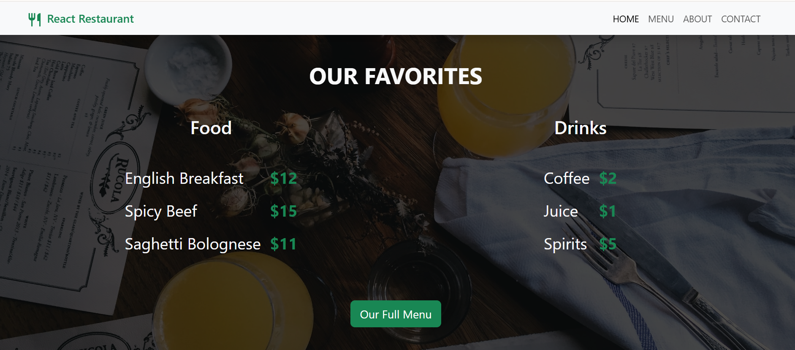

# 🍽️ Restaurant Website

A beautifully designed and responsive **restaurant website** built using **React.js**, **React routing**, styled with **Bootstrap** and enhanced with **Google Fonts**, **React Icons**, and high-quality **Unsplash** images. This project is optimized for performance and user experience using **Vite** as the build tool.

## 🚀 Live Demo

🔗 [View Live Site](https://restaurant-website25.netlify.app/)

## 📸 Preview

---

## 🛠️ Tech Stack

- ⚛️ React.js (with Vite)
- 🎨 Bootstrap 5
- 🖋️ Google Fonts
- 🍽️ Unsplash Free Images
- 🎯 React Icons
- ⚡ Vite (Fast development server)
- 📱 Responsive Design

---

## 💡 Features

- ✨ Visually engaging layout tailored for food businesses
- 🔗 Smooth navigation and component-based structure
- 📷 Stunning visuals from **Unsplash** for food sections
- 🎨 Styled using **Bootstrap 5** for responsiveness
- 🔤 Elegant typography with **Google Fonts**
- 💻 Built using **Vite** for faster performance
- 🧼 Clean, modular code and folder structure

---

Author
Md. Tajul Islam
🌐 [Portfolio Website](https://tajulbappy.netlify.app/)
📧 bappy042@gmail.com
👨‍💻 [GitHub](https://github.com/tajulbappy)

© 2025 Tajul Islam. All rights reserved.
